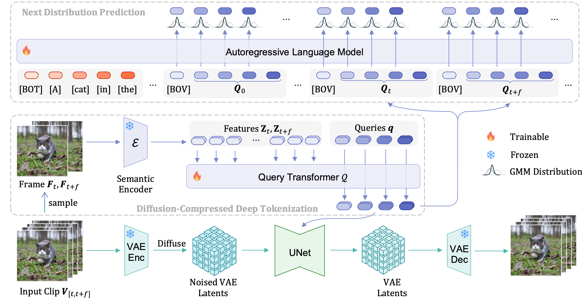
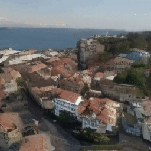
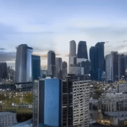
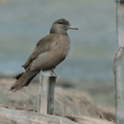
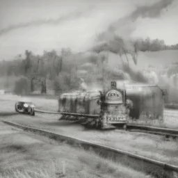

<div align="center">

# DiCoDe: Diffusion-Compressed Deep Tokens for Autoregressive Video Generation with Language Models

[](https://liyizhuo.com/DiCoDe/) [](https://arxiv.org/abs/2412.04446) [](https://huggingface.co/liyz/DiCoDe)

</div>

> We introduce DiCoDe, a novel approach that leverages **Di**ffusion-**Co**mpressed **De**ep Tokens to generate videos with a language model in an autoregressive manner. Unlike existing methods that employ low-level representations with limited compression rates, DiCoDe utilizes deep tokens with a considerable compression rate (a 1000x reduction in token count). This significant compression is made possible by a tokenizer trained through leveraging the prior knowledge of video diffusion models. Deep tokens enable DiCoDe to employ vanilla AR language models for video generation, akin to translating one visual "language" into another. By treating videos as temporal sequences, DiCoDe fully harnesses the capabilities of language models for autoregressive generation. DiCoDe is scalable using readily available AR architectures, and is capable of generating videos ranging from a few seconds to one minute using only 4 A100 GPUs for training.

## Table of Contents
- [DiCoDe: Diffusion-Compressed Deep Tokens for Autoregressive Video Generation with Language Models](#dicode-diffusion-compressed-deep-tokens-for-autoregressive-video-generation-with-language-models)
  - [Table of Contents](#table-of-contents)
  - [Framework](#framework)
  - [Showcase](#showcase)
    - [Tokenization](#tokenization)
    - [Short Video Generation](#short-video-generation)
    - [Long Video Generation](#long-video-generation)
  - [Getting Started](#getting-started)
    - [Installation](#installation)
    - [Download Pre-trained Models](#download-pre-trained-models)
  - [Inference](#inference)
    - [Tokenizer Demo](#tokenizer-demo)
    - [Autoregressive Language Model Demo](#autoregressive-language-model-demo)
  - [Citation](#citation)
  - [Acknowledgement](#acknowledgement)

## Framework

DiCoDe introduces a two-stage approach for video generation:

1. **Tokenization Stage**: A video diffusion model serves as a tokenizer to extract highly-compressed deep tokens from videos. This reduces token count by 1000x compared to traditional methods.

2. **Generation Stage**: An autoregressive language model predicts sequences of deep tokens conditioned on text prompts, enabling efficient video generation.




## Showcase

### Tokenization

<table class="center" style="width: 100%; text-align: center;">
  <tr>
    <td style="width: 25%;font-weight:bold">Original</td>
    <td style="width: 25%;font-weight:bold">Reconstruction</td>
    <td style="width: 25%;font-weight:bold">Original</td>
    <td style="width: 25%;font-weight:bold">Reconstruction</td>
  </tr>
  <tr>
    <td style="width: 25%;">
      
    </td>
    <td style="width: 25%;">
      
    </td>
    <td style="width: 25%;">
      
    </td>
    <td style="width: 25%;">
      
    </td>
  </tr>
  <tr>
    <td style="width: 25%;">
      
    </td>
    <td style="width: 25%;">
      
    </td>
    <td style="width: 25%;">
      
    </td>
    <td style="width: 25%;">
      
    </td>
  </tr>
</table>

### Short Video Generation

<table class="center" style="width: 100%; text-align: center;">
  <tr>
    <td style="width: 25%;font-weight:bold">A hot air balloon animation</td>
    <td style="width: 25%;font-weight:bold">A dramatic oil painting of a stormy ocean</td>
    <td style="width: 25%;font-weight:bold">A drone flying over a coastal town</td>
    <td style="width: 25%;font-weight:bold">A time-lapse of clouds moving across a blue sky</td>
  </tr>
  <tr>
    <td style="width: 25%;">
      
    </td>
    <td style="width: 25%;">
      
    </td>
    <td style="width: 25%;">
      
    </td>
    <td style="width: 25%;">
      
    </td>
  </tr>
  <tr>
    <td style="width: 25%;font-weight:bold">A time-lapse of a city skyline transitioning from day to night</td>
    <td style="width: 25%;font-weight:bold">A bird taking a break on a sturdy fence post</td>
    <td style="width: 25%;font-weight:bold">An elderly couple walking hand in hand, surrounded by a sunset's glow</td>
    <td style="width: 25%;font-weight:bold">A black and white photograph of an old train traveling through the countryside</td>
  </tr>
  <tr>
    <td style="width: 25%;">
      
    </td>
    <td style="width: 25%;">
      
    </td>
    <td style="width: 25%;">
      
    </td>
    <td style="width: 25%;">
      
    </td>
  </tr>
  
</table>

### Long Video Generation

<table class="center" style="width: 100%; text-align: center;">
  <tr>
    <td style="width: 25%;font-weight:bold">A close-up of a butterfly landing on a flower</td>
    <td style="width: 25%;font-weight:bold">A single candle burning brightly in the dark</td>
    <td style="width: 25%;font-weight:bold">A stunning oil painting depicting a stormy sea with waves crashing dramatically</td>
    <td style="width: 25%;font-weight:bold">A time-lapse of clouds drifting across a blue sky</td>
  </tr>
  <tr>
    <td style="width: 25%;">
      
    </td>
    <td style="width: 25%;">
      
    </td>
    <td style="width: 25%;">
      
    </td>
    <td style="width: 25%;">
      
    </td>
  </tr>
</table>

## Getting Started

### Installation

```bash
# Clone the repository
git clone https://github.com/liyz15/DiCoDe.git
cd DiCoDe

# Install dependencies
pip install -r requirements.txt
```

### Download Pre-trained Models

You can download OpenCLIP ViT-H/14 [here](https://huggingface.co/laion/CLIP-ViT-H-14-laion2B-s32B-b79K/blob/main/open_clip_pytorch_model.bin) and pre-trained DiCoDe models from [huggingface](https://huggingface.co/liyz/DiCoDe).

For the tokenizer demo, you will need `pytorch_model.bin`. For the llm demo, you will need `gpt2_large.bin` and `gpt2-large/`.

Place or link all models under `models` directory, the final folder should looks like: 

```
- models/
  - open_clip_pytorch_model.bin
  - pytorch_model.bin
  - gpt2_large.bin
  - gpt2-large/
```

## Inference

### Tokenizer Demo

We provide a simple demo script to demonstrate the tokenization process. The script takes a video as input and outputs a reconstructed version using our diffusion-based tokenizer model.

```bash
# Run the tokenization demo with default settings
python demo_tokenization.py

# Run with custom input video
python demo_tokenization.py --input_video path/to/your/video.mp4 --output_dir results/
```

The demo extracts the first and last frames from the input video and uses them to reconstruct the original video, showcasing the effectiveness of our compression and reconstruction capabilities.

### Autoregressive Language Model Demo

This demo allows you to generate videos using text prompts. The language model predicts deep tokens autoregressively based on your input prompt.

```bash
# Run the LLM-based video generation demo
python demo_llm.py --prompt "Your text prompt here"
```

## Citation

If you find this work helpful, please consider citing:

```
@article{li2024dicode,
  title={DiCoDe: Diffusion-Compressed Deep Tokens for Autoregressive Video Generation with Language Models},
  author={Li, Yizhuo and Ge, Yuying and Ge, Yixiao and Luo, Ping and Shan, Ying},
  journal={arXiv preprint arXiv:2412.04446},
  year={2024}
}
```

## Acknowledgement

This project builds upon the work of many outstanding prior research efforts including but not limited to:

- [GPT2](https://github.com/openai/gpt-2)
- [DynamiCrafter](https://github.com/Doubiiu/DynamiCrafter)
- [IP-Adapter](https://github.com/tencent-ailab/IP-Adapter)

Thanks for their great work!
